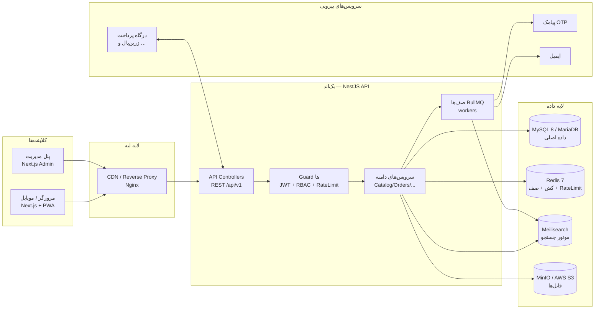

# ۰۱ — معماری پروژه کارزینتل

> فروشگاه آنلاین قطعات و گجت‌های الکترونیک (موبایل، ساعت هوشمند، هدفون و …)
> نسخه: ۱.۰ — تاریخ: ۲۰۲۶-۰۷-۱۸

---

## ۱. نمای کلی سیستم



**جریان خلاصه:** کلاینت فقط با API اصلی صحبت می‌کند. API روی MySQL/MariaDB قانون داده می‌گذارد، Redis برای کش/صف/rate-limit، Meilisearch برای جستجوی فوری محصول، و MinIO (سازگار با S3) برای فایل‌ها استفاده می‌شود. کارهای سنگین و غیرهمگام (پیامک، ایمیل، سینک جستجو، اعلان‌ها) در صف BullMQ انجام می‌شوند.

---

## ۲. انتخاب‌های تکنولوژیک و دلیلشان

| لایه | انتخاب | جایگزین آماده | دلیل |
|---|---|---|---|
| Frontend | **Next.js ۱۵ (App Router) + React ۱۹ + TypeScript** | — | SSR/SSG برای SEO فروشگاه، RSC، کش سمت سرور، routing فایل‌محور |
| استایل | **Tailwind CSS ۴** + shadcn/ui | — | سرعت توسعه، RTL خوب، Design Token |
| Backend | **NestJS ۱۱ (Node.js ۲۲ LTS)** | Laravel (آماده سوییچ) | معماری ماژولار تمیز، TypeScript مشترک با فرانت، اکوسیستم بزرگ |
| ORM | **TypeORM + Migration** | Prisma | کنترل کامل روی SQL، بدون synchronize در production |
| Database | **MySQL 8 / MariaDB 10.5+** | MySQL/MariaDB | دیتابیس مدیریت‌شده، تراکنش، JSON، سازگار با cPanel |
| Cache/Queue | **Redis 7** + BullMQ | — | کش، صف، rate-limit، lock توزیع‌شده |
| Search | **Meilisearch** | Elasticsearch (interface آماده) | سبک، سریع، تنظیم آسان روی محصولات؛ مهاجرت به ES فقط با تعویض adapter |
| Storage | **MinIO (S3 API)** | AWS S3 | کد یکسان با `aws-sdk`؛ production فقط با ENV سوییچ می‌کند |
| Auth | **JWT (access ۱۵د + refresh ۳۰روز) + RBAC** | — | stateless بودن access + امکان revoke با refresh در DB |
| تست | Jest + Supertest + Playwright | — | unit / e2e API / e2e مرورگر |
| کیفیت کد | ESLint + Prettier + Husky + lint-staged | — | — |

> **تصمیم کلیدی:** یک زبان (TypeScript) در کل پشته → تایپ‌های مشترک در `packages/shared` بین فرانت و بک‌اند (DTO, enum, permission keys).

---

## ۳. معماری بک‌اند (NestJS) — ماژول‌ها

هر ماژول ساختار یکسان دارد: `controller → service → repository(entity)`، با DTO ورودی/خروجی و تست.

| ماژول | مسیر | مسئولیت | وابستگی |
|---|---|---|---|
| `auth` | `/auth` | ثبت‌نام، ورود (رمز/OTP)، خروج، refresh، فراموشی رمز | Redis(OTP throttle), DB(refresh_tokens) |
| `users` | `/users`, `/me` | پروفایل، دفتر آدرس، علاقه‌مندی‌ها | DB |
| `rbac` | داخلی + `/admin/roles` | Guard دسترسی، نقش/مجوز/override | Redis (کش مجوز کاربر ۶۰ث) |
| `catalog` | `/categories`, `/brands`, `/products` | درخت دسته، برند، محصول، تنوع، تصویر | DB, Redis(کش), Events→Search |
| `attributes` | `/admin/attributes` | صفت‌ها و مقادیر، اتصال به دسته | DB |
| `inventory` | `/admin/inventory` | انبارها، موجودی، گردش انبار، رزرو | DB (transaction), Redis(lock) |
| `search` | `/search` | ایندکس محصولات، autocomplete | Meilisearch, BullMQ(sync) |
| `cart` | `/cart` | سبد کاربر/مهمان، merge بعد از ورود، کوپن | Redis(hot) + MySQL/MariaDB(persist) |
| `orders` | `/orders`, `/checkout` | ثبت سفارش، state machine وضعیت، تاریخچه | DB(transaction), Events |
| `payments` | `/payments` (+ callback) | آداپتور درگاه‌ها، idempotency، تطبیق | DB, PAY |
| `shipping` | داخلی | روش‌های ارسال و هزینه، کد رهگیری | DB |
| `coupons` | `/admin/coupons` + صحت‌سنجی در cart | کوپن‌ها و محدودیت‌ها | DB, Redis |
| `reviews` | `/products/:id/reviews` | دیدگاه، پرسش‌وپاسخ، مدیریت | DB |
| `cms` | `/banners`, `/pages` | بنر، صفحات ثابت | DB, Redis |
| `tickets` | `/tickets` | پشتیبانی | DB, notifications |
| `notifications` | `/me/notifications` | اعلان درون‌برنامه + dispatch پیامک/ایمیل | DB, BullMQ |
| `files` | `/files` | آپلود با presigned URL، ثبت در جدول files | S3/MinIO |
| `settings` | `/admin/settings` | تنظیمات کش‌شده | DB, Redis |
| `audit` | داخلی + `/admin/audit-logs` | ثبت خودکار عملیات حساس (interceptor) | DB |
| `health` | `/health` | liveness/readiness (db, redis, meili, s3) | همه |

### قواعد معماری (Design Rules)
1. **کنترلر لاغر، سرویس چاق:** منطق فقط در سرویس؛ کنترلر فقط DTO↔Response.
2. **تراکنش دیتابیس:** ثبت سفارش + کسر موجودی + مصرف کوپن در **یک تراکنش** با `SELECT … FOR UPDATE` روی ردیف inventory.
3. **Event-Driven سبک:** رویدادهای `product.updated`, `order.paid` روی EventEmitter داخلی → مصرف‌کننده (سینک Meili، اعلان) → در صورت شکست به BullMQ می‌افتد (retry ×5, backoff).
4. **Idempotency:** callback پرداخت روی `(gateway, authority)` یکتا است؛ ثبت سفارش با `Idempotency-Key` از کلاینت محافظت می‌شود.
5. **همه خروجی‌ها camelCase** در JSON؛ در DB ستون‌ها snake_case.

---

## ۴. معماری فرانت‌اند (Next.js)

دو سطح در یک اپ:

```
app/
├── (shop)/            → ویترین عمومی: SSR + ISR، سئو، PWA
│   ├── / products/[slug] categories/[slug] search cart checkout account/*
├── (auth)/            → login | register | otp
└── admin/             → پنل مدیریت: محافظت‌شده با middleware + middleware RBAC
    ├── dashboard | products | categories | orders | customers
    ├── users | roles   ← مدیریت کاربران و دسترسی‌ها (نیاز پروژه)
    └── marketing | settings | tickets | reports
```

- **جریان احراز هویت:** access token در حافظه (React state) + refresh در **httpOnly cookie**؛ `lib/api-client` در ۴۰۱ به‌صورت خودکار یک‌بار refresh و retry می‌کند.
- **Data fetching:** سرورکامپوننت‌ها مستقیم به API با کش Next (`revalidate`)؛ اکشن‌های نوشتنی از کلاینت با React Query/ky.
- **دسترسی ادمین:** `middleware.ts` نقش‌ها را چک می‌کند؛ درون پنل، هر صفحه مجوز لازم (`usePermission('products.create')`) برای مخفی/نشان دادن اکشن‌ها دارد.
- **PWA (اختیاری مرحله آخر):** `manifest.json` + service worker کش استاتیک/تصاویر.
- **i18n-ready:** همه رشته‌ها فارسی در یک لایه؛ جهت `rtl` در root.

---

## ۵. احراز هویت و مدل دسترسی (RBAC)

```
users ──< role_user >── roles ──< permission_role >── permissions
  └────< permission_user (override: allow / deny)
```

- **دسترسی مؤثر کاربر** = ⋃ مجوزهای نقش‌ها، **منهای** deny های مستقیم، **به‌علاوه** allow های مستقیم.
- Guard نمونه: `@RequirePermissions('products.create')` روی اکشن‌های ادمین.
- مجوز کاربر در Redis کش می‌شود (`user:{id}:perms`, TTL=۶۰ثانیه) و با تغییر نقش/مجوز invalidate می‌شود.
- **ادمین اولیه:** `super_admin` با تمام مجوزها (seed در `database/schema.sql`) — از طریق پنل می‌تواند **کاربر جدید بسازد، نقش تعریف کند و مجوز تخصیص دهد** (درخواست اصلی پروژه).
- OTP ورود با پیامک: کد ۵ رقمی، TTL دو دقیقه، حداکثر ۵ تلاش، throttle روی شماره/IP در Redis.

---

## ۶. استراتژی کش (Redis)

| داده | کلید | TTL | Invalidate |
|---|---|---|---|
| درخت دسته‌بندی‌ها | `cat:tree` | ۱ ساعت | رویداد category.* |
| صفحه محصول | `product:slug:{slug}` | ۱۰ دقیقه | product.updated |
| بنرهای فعال | `banners:{position}` | ۱۵ دقیقه | banner.updated |
| تنظیمات | `settings:all` | ۵ دقیقه | settings.updated |
| مجوز کاربر | `user:{id}:perms` | ۶۰ ثانیه | rbac.changed |
| سبد مهمان | `cart:session:{sid}` | ۳۰ روز (sliding) | — |
| Rate limit | `rl:{ip}:{route}` | ۶۰ثانیه | — |
| نتایج داغ جستجو | `search:{hash}` | ۶۰ ثانیه | — |
| قفل‌ها | `lock:order:{id}` | ۳۰ ثانیه | خودکار |

---

## ۷. جستجو (Meilisearch)

- ایندکس واحد `products`: هر سند = محصول + تنوع‌ها (flatten شده).
- `searchableAttributes`: name, brand, category.name, sku, short_description
- `filterableAttributes`: category_slug, brand_id, price, attributes.* , in_stock, status
- `sortableAttributes`: price, created_at, sold_count, rating_avg
- **سینک:** رویداد `product.*` → job در BullMQ → upsert/delete در Meili؛ لاگ شکست + retry. ابزار `reindex:all` برای بازسازی کامل.
- API فروشگاه `GET /search` و `GET /products` (لیست با فیلتر) هر دو از Meili می‌خوانند؛ fallback به MySQL/MariaDB در صورت قطع Meili (تجربه قطع نشدن فروش).

---

## ۸. فایل‌ها (MinIO / AWS S3)

```
karzintell/                ← یک باکت
├── products/{productId}/{uuid}.webp
├── banners/{uuid}.webp
├── avatars/{userId}.webp
└── invoices/{orderId}.pdf  (private)
```

- آپلود مستقیم کلاینت با **presigned PUT URL** (درخواست از `POST /files/presign`)؛ API بعد از تأیید، رکورد `files` می‌سازد.
- تصاویر محصول در ۳ سایز (thumb/medium/large) توسط worker با sharp پردازش می‌شوند.
- در production: فقط `S3_ENDPOINT/KEY/SECRET/BUCKET` به AWS تغییر می‌کند.

---

## ۹. پرداخت و قابلیت اطمینان سفارش

- آداپتور درگاه: `PaymentGateway` interface (zarinpal اولیه؛ idpay/zibal بعداً).
- چرخه: `checkout` (ایجاد order=pending_payment + رزرو موجودی) → `payments/init` → هدایت به درگاه → `callback` → verify → `order.paid` → job اعلان/فاکتور.
- رزرو موجودی **۱۵ دقیقه**: اگر پرداخت نشد، job زمان‌بندی‌شده `release` می‌کند (`stock_movements`).
- هر تغییر وضعیت سفارش فقط از مسیر **state machine** مجاز + رکورد در `order_status_histories`.

---

## ۱۰. امنیت

| حوزه | راهکار |
|---|---|
| احراز هویت | bcrypt(10)، JWT کوتاه‌عمر، refresh rotation + revoke، OTP rate-limit |
| Authorization | RBAC دانه‌ای + کش + بررسی سروری در هر route |
| HTTP | helmet، CORS whitelist، body limit 1MB، compression |
| ورودی | class-validator روی همه DTOها، whitelist strip |
| SQL | TypeORM parameterized؛ هیچ raw query بدون bind |
| XSS | خروجی React به‌صورت پیش‌فرض escape؛ HTML توضیحات با sanitize-html سمت سرور |
| Password reset / OTP | هش ذخیره می‌شود، نه متن باز |
| اسرار | فقط ENV؛ `.env` در gitignore؛ `env.validation` هنگام بوت |
| لاگ | بدون PII حساس (رمز/توکن/کارت هرگز لاگ نمی‌شود) |
| ادمین | `must_change_password` برای کاربران جدیدساخته، audit کامل عملیات |

---

## ۱۱. استقرار (Deployment)

- **توسعه (همین repo):** `docker compose up -d` → Redis/Meili/MinIO/MailHog (دیتابیس MySQL/MariaDB روی cPanel یا سرور MySQL). اپ‌ها در مرحله بعد به compose اضافه می‌شوند.
- **پروداکشن (پیشنهاد مرحله اول):** یک VPS لینوکسی + Docker Compose (web, api, worker, nginx + certbot)، MySQL/MariaDB مدیریت‌شده با backup روزانه `mysqldump | gzip` به S3، Redis با AOF، MinIO→AWS S3.
- **مقیاس بعدی:** api/worker افقی (stateless)، Uptime: `/health/ready`، لاگ متمرکز (بعداً Loki/ELK)، متریک Prometheus.

---

## ۱۲. نقشه راه مراحل

| مرحله | خروجی | وضعیت |
|---|---|---|
| ۱ | معماری، دیتابیس، API، ساختار پوشه‌ها، infra توسعه | ✅ همین مرحله |
| ۲ | اسکلت Monorepo: راه‌اندازی Next.js + NestJS + shared + auth/RBAC + seed | ⬜ |
| ۳ | کاتالوگ و جستجو و فایل‌ها (فروشگاه عمومی) | ⬜ |
| ۴ | سبد، تسویه، پرداخت سندباکس، سفارش‌ها | ⬜ |
| ۵ | پنل ادمین کامل (محصول/سفارش/کاربر/نقش/گزارش) | ⬜ |
| ۶ | سخت‌سازی: تست، بهینه‌سازی، PWA، CI/CD، مستقر نهایی | ⬜ |
