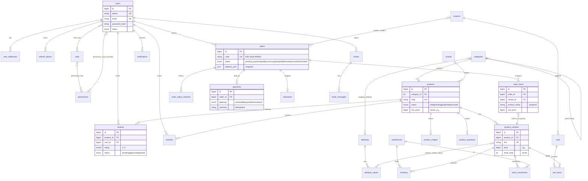

# ۰۲ — طراحی پایگاه‌داده کارزینتل (MySQL 8)

فایل DDL کامل و قابل اجرا: [`database/schema.sql`](../database/schema.sql) — ۴۱ جدول + داده اولیه.

---

## ۱. اصول طراحی

1. **InnoDB + utf8mb4** روی همه جداول (پشتیبانی کامل فارسی و emoji).
2. **پول به ریال در `BIGINT UNSIGNED`** — نه FLOAT/DECIMAL کوچک؛ احتمال overflow در مبالغ کلان وجود ندارد.
3. **Soft Delete** با ستون `deleted_at` روی موجودیت‌های اصلی (users، products، orders، categories، …).
4. **Snapshot در سفارش:** آدرس (`address_json`)، نام محصول، SKU و قیمت در `order_items` کپی می‌شود تا تغییر بعدی محصول تاریخچه را خراب نکند.
5. **موجودی در سطح تنوع (Variant)** و تفکیک‌شده به ازای انبار؛ قابل‌فروش = `quantity - reserved`. تمام تغییرات در `stock_movements` ثبت می‌شود (قابل حسابرسی).
6. **ایندکس‌گذاری بر اساس کوئری‌های واقعی** فهرست‌شده در بخش ۵.
7. **زمان‌ها UTC** (`DATETIME`)؛ نمایش به Asia/Tehran در لایه نمایش.
8. **idempotency:** کلیدهای یکتا روی `payments(gateway, authority)`، `coupon_usages(coupon_id, order_id)`، `cart_items(cart_id, variant_id)`.

---

## ۲. نمودار ERD



---

## ۳. تقسیم‌بندی جداول و نکات هر گروه

### ۳‑۱) کاربران و RBAC — `users, roles, permissions, role_user, permission_role, permission_user, user_addresses, verification_codes, refresh_tokens`
- RBAC کلاسیک + جدول `permission_user` برای override موردی (`allow`/`deny`) — ادمین می‌تواند به کاربری خاص دسترسی بدهد یا موقت بگیرد بدون دست‌کاری نقش.
- `role_user.assigned_by` مشخص می‌کند کدام ادمین نقش را تخصیص داده (قابل حسابرسی).
- OTPها فقط **هش‌شده** در `verification_codes` ذخیره می‌شوند.

### ۳‑۲) کاتالوگ — `brands, categories, attributes, attribute_values, category_attribute, products, product_variants, product_variant_values, product_images`
- دسته‌بندی **درختی** با `parent_id` (برای صفحه نمایش درخت کش می‌شود؛ مهاجرت آینده به closure table در صورت نیاز).
- مدل **EAV هدایت‌شده**: صفت‌ها فقط از طریق `category_attribute` به دسته متصل‌اند؛ ستون `is_variant` تعیین می‌کند کدام صفت در ساخت تنوع شرکت می‌کند (مثل رنگ/حافظه برای موبایل) و بقیه صرفاً مشخصات نمایشی‌اند.
- `products.min_price/max_price` کشِ قیمت برای لیست‌ها است که با رویداد تغییر variant به‌روز می‌شود (جلوگیری از JOIN گروه‌بندی در هر لیست).
- یکتایی نماک (slug) در `categories/brands/products` برای URLهای تمیز سئو.

### ۳‑۳) انبار — `warehouses, inventory, stock_movements`
- `inventory` کلید مرکب `(variant_id, warehouse_id)`؛ با `SELECT … FOR UPDATE` در تراکنش سفارش قفل می‌شود.
- `stock_movements` دارای `qty_before/qty_after` → بازسازی تاریخی موجودی هر لحظه ممکن است.

### ۳‑۴) سبد/کوپن — `carts, cart_items, coupons, coupon_usages`
- سبد برای کاربر لاگین (`user_id`) یا مهمان (`session_id` از کوکی)؛ هنگام ورود دو سبد merge می‌شوند (`status=merged`).
- محدودیت‌های کوپن: سقف تخفیف، حداقل سبد، سقف استفاده کل/هر کاربر، بازه زمانی؛ مصرف در تراکنش سفارش ثبت می‌شود.

### ۳‑۵) سفارش/پرداخت — `orders, order_items, order_status_histories, payments, shipments`
- وضعیت سفارش فقط از مسیر state machine تغییر می‌کند و هر گذر در `order_status_histories` با `changed_by` ثبت می‌شود.
- `FK` روی user با `ON DELETE RESTRICT`: حذف کاربر هرگز تاریخچه سفارش را نمی‌کند (حذف کاربر فقط soft است).
- پرداخت چنددرگاهی؛ `payload` خام درگاه برای عیب‌یابی نگهداری می‌شود.

### ۳‑۶) بازخورد/CMS/پشتیبانی — `reviews, product_questions, wishlists, banners, pages, tickets, ticket_messages`
- دیدگاه پیش‌فرض `pending` است تا پس از تأیید منتشر شود؛ `UNIQUE(product_id, user_id)` جلوی اسپم می‌گیرد.
- `ticket_messages.is_internal` یادداشت داخلی ادمین است و به مشتری نشان داده نمی‌شود.

### ۳‑۷) زیرساخت — `files, notifications, settings, audit_logs`
- `settings` کلید-مقدار تایپ‌دار با `is_public` (مواردی مثل نام فروشگاه از API عمومی خوانده می‌شوند).
- `audit_logs` با یک Interceptor سراسری از اکشن‌های ادمین (subject + old/new + ip) پر می‌شود.

---

## ۴. ایندکس‌های کلیدی

| کوئری پرتکرار | ایندکس |
|---|---|
| لیست محصولات یک دستهٔ منتشرشده | `products(category_id, status)` + `products(status, published_at)` |
| صفحه محصول از روی slug | `UNIQUE products(slug)` / `UNIQUE product_variants(sku)` |
| سفارش‌های کاربر | `orders(user_id, created_at)` |
| صف سفارش‌های در انتظار پردازش | `orders(status, created_at)` |
| نمایش دیدگاه‌های تأییدشده محصول | `reviews(product_id, status, created_at)` |
| اعلان‌های ناخوانده | `notifications(user_id, read_at, created_at)` |
| اتصال JWT به درگاه (idempotency) | `UNIQUE payments(gateway, authority)` |
| جستجوی متنی محصول | عمداً FULLTEXT نداریم → **Meilisearch** مسئول است |

---

## ۵. داده اولیه (Seed)

با اجرای `schema.sql` آماده می‌شوند:

| مورد | مقدار |
|---|---|
| نقش‌ها | super_admin, manager, support, warehouse, customer |
| مجوزها | ۳۸ مجوز دانه‌ای (گروه‌بندی‌شده) |
| نگاشت نقش↔مجوز | super_admin=همه؛ manager/support/warehouse طبق جدول دسترسی مستند |
| **ادمین پیش‌فرض** | phone: `09000000000` — email: `admin@karzintell.ir` — رمز: `Admin@123456` (بلافاصله باید عوض شود: `must_change_password=1`) |
| انبار | «انبار مرکزی» |
| نمونه کاتالوگ | ۷ دسته (موبایل، ساعت هوشمند، …)، ۵ برند، ۴ صفت + مقادیر |

---

## ۶. اجرای اسکیما (توسعه)

```bash
docker compose up -d mysql
docker exec -i karzintell-mysql mysql -uroot -proot_secret < database/schema.sql
# مشاهده در رابط وب: http://localhost:8080  (Adminer)
#   System: MySQL | Server: mysql | User: karzintell | Pass: secret | DB: karzintell
```

## ۷. سیاست نگهداشت

- **Migrationها:** در مرحله ۲ با TypeORM Migration مدیریت می‌شوند؛ `schema.sql` مرجع طراحی و راه‌انداز اولیه است.
- **Backup:** `mysqldump --single-transaction --routines` شبانه + نگهداری ۳۰ روز + کپی هفتگی روی S3.
- **Retention:** سفارش‌ها و پرداخت‌ها هرگز hard-delete نمی‌شوند؛ `audit_logs` پس از ۱۸ ماه به آرشیو سرد منتقل می‌شود.
